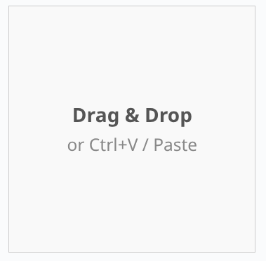
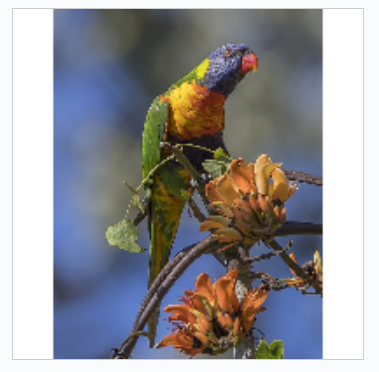
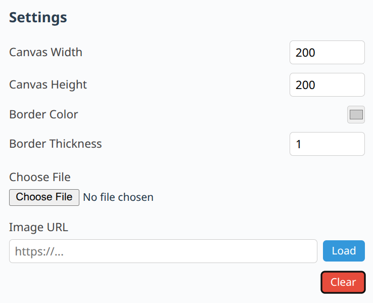

# Color From Image

React component for extracting dominant colors from images using advanced color analysis algorithms.

**Play around and Generate component code here:**  
https://studiotoolkit.github.io/build-color-from-image

**Complete Demo:**  
https://studiotoolkit.github.io/demo-all

**Complete functionality:**  
https://studiotoolkit.github.io/color-from-image-help

## Features

<table>
<tr>
<td align="center"><br/>Empty Canvas</td>
</tr>
<tr>
<td align="center"><br/>Image Pasted</td>
</tr>
<tr>
<td align="center"><br/>Parameters</td>
</tr>
</table>

- Extract dominant colors from any image using OKLab color space and K-Means++ clustering
- Drag and drop or paste image support (Ctrl+V)
- Customizable canvas dimensions (`width`, `height`)
- Border styling options (`borderColor`, `borderThickness`)
- Load from URL (`imageUrl`) or file object (`imageFile`)
- Programmatic clear with `clearTrigger`
- CORS-aware image loading with fallback
- Color extraction callback (`onColorsExtracted`)

## Installation

```bash
# Using pnpm
pnpm add @studiotoolkit/color-from-image

# Using npm
npm install @studiotoolkit/color-from-image

# Using yarn
yarn add @studiotoolkit/color-from-image
```

**React Version:** `^18.0.0` or higher

## Usage

### Basic Usage

```tsx
import { ColorFromImage } from '@studiotoolkit/color-from-image';
import '@studiotoolkit/color-from-image/style.css';

function App() {
  const handleColorsExtracted = (colors) => {
    console.log('Extracted colors:', colors);
  };

  return <ColorFromImage onColorsExtracted={handleColorsExtracted} />;
}
```

**Sample Output:**

```json
{
  "palette": [
    "#627bb8",
    "#53689e",
    "#4c597d",
    "#6c6d67",
    "#6b3d18",
    "#657092",
    "#43311b",
    "#494b4e",
    "#81889e",
    "#965528",
    "#bc773f",
    "#221b15",
    "#808748",
    "#615d2a",
    "#cdab71",
    "#f1d85d"
  ]
}
```

### Steps to Use

1. Import the component and its styles
2. Add the `ColorFromImage` component to your app
3. Paste an image or drag and drop onto the canvas
4. The component will automatically extract dominant colors
5. Use the `onColorsExtracted` callback to receive the color palette

## Contributors

[StudioToolkit](https://github.com/studiotoolkit)

## License

Licensed under the MIT License.

## Keywords

color-extraction, image-colors, dominant-colors, color-analysis, image-processing, color-palette, react-component, design-tools
