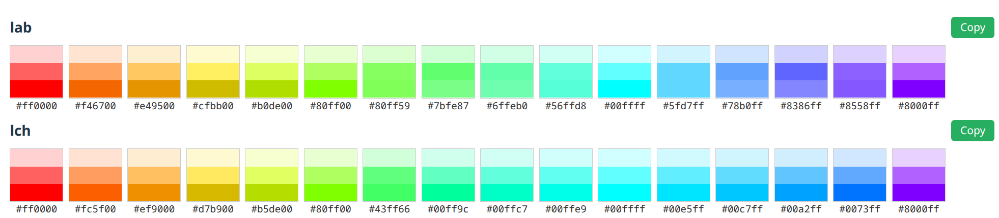
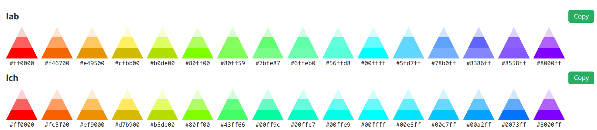
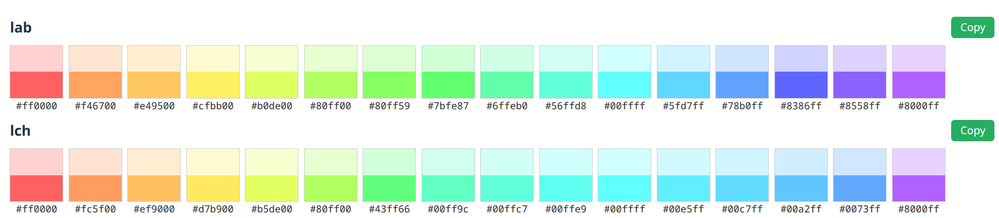
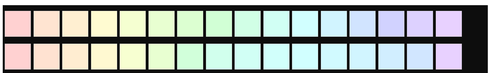
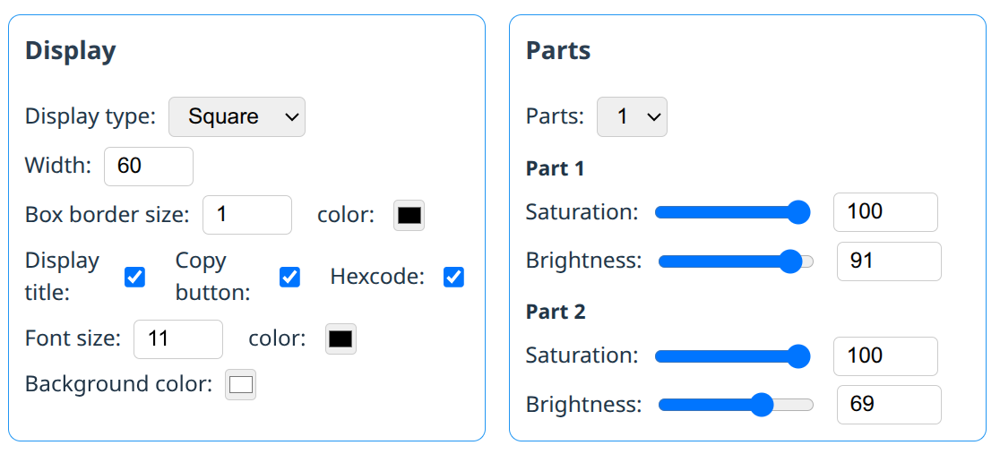

# Color Palette

React component for displaying and managing color palettes with multiple display modes and customization options.

**Play around and Generate component code here:**  
https://studiotoolkit.github.io/build-color-palette

**Complete Demo:**  
https://studiotoolkit.github.io/demo-all

## Features

<table>
<tr>
<td align="center"><br/>Box</td>
</tr>
<tr>
<td align="center"><br/>Circle</td>
</tr>
<tr>
<td align="center"><br/>Square</td>
</tr>
<tr>
<td align="center"><br/>Triangle</td>
</tr>
<tr>
<td align="center"><br/>Single Tone</td>
</tr>
<tr>
<td align="center"><br/>Two Tone</td>
</tr>
<tr>
<tr>
<td align="center"><br/>Variation</td>
</tr>
<td align="center"><br/>Parameters</td>
</tr>

</table>

- Multiple display modes: square, table, circle, triangle, block
- Multi-part color swatches (1, 2, or 3 parts) with saturation/brightness control
- Customizable dimensions (`width`)
- Border styling (`boxBorderSize`, `boxBorderColor`)
- Typography options (`displayTitle`, `fontColor`, `fontSize`)
- Background color customization (`backgroundColor`)
- Hex code display toggle (`displayHexcode`)
- Copy colors to clipboard (`showCopyButton`)
- Transform colors with adjustable saturation and brightness per part

## Installation

```bash
# Using pnpm
pnpm add @studiotoolkit/color-palette

# Using npm
npm install @studiotoolkit/color-palette

# Using yarn
yarn add @studiotoolkit/color-palette
```

**React Version:** `^18.0.0` or higher

## Usage

### Basic Usage

```tsx
import { ColorPalette } from '@studiotoolkit/color-palette';
import '@studiotoolkit/color-palette/style.css';

function App() {
  const paletteData = {
    primary: ['#FF5733', '#33FF57', '#3357FF'],
    secondary: ['#FFC300', '#DAF7A6', '#C70039'],
  };

  return <ColorPalette paletteData={paletteData} displayType="square" showCopyButton={true} />;
}
```

### Steps to Use

1. Import the component and its styles
2. Prepare palette data as an object with string arrays
3. Add the `ColorPalette` component with desired display type
4. Customize appearance with optional props
5. Enable copy button to allow users to copy colors

## Contributors

[StudioToolkit](https://github.com/studiotoolkit)

## License

Licensed under the MIT License.

## Keywords

color-palette, color-display, color-swatches, palette-viewer, color-management, design-tools, react-component, color-visualization
