# Color Wheel

Interactive color wheel React component for creating and manipulating color harmonies with support for multiple harmony modes and customization options.

**Play around and Generate component code here:**  
https://studiotoolkit.github.io/build-color-wheel

**Complete Demo:**  
https://studiotoolkit.github.io/demo-all

## Features

### Harmony Modes

<table>
<tr>
<td align="center">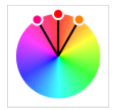<br/>Analogous</td>
<td align="center">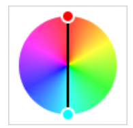<br/>Complementary</td>
<td align="center">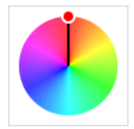<br/>Monochromatic</td>
<td align="center">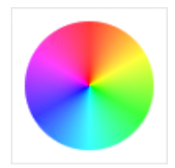<br/>Simple</td>
</tr>
<tr>
<td align="center">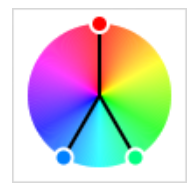<br/>Split Complementary</td>
<td align="center">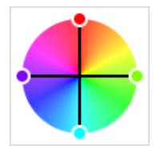<br/>Square</td>
<td align="center">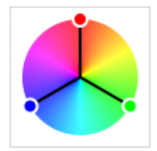<br/>Triadic</td>
<td align="center"></td>
</tr>
</table>

### Customization Options

<table>
<tr>
<td align="center">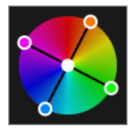<br/>Background Color</td>
<td align="center">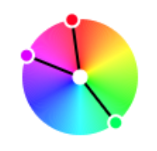<br/>Center Dot</td>
<td align="center">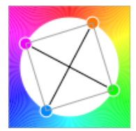<br/>Harmony Polygon</td>
<td align="center"><br/>Thickness</td>
</tr>
<tr>
<td align="center">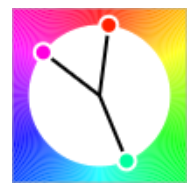<br/>Thickness variation</td>
<td align="center"></td>
<td align="center"></td>
<td align="center"></td>
</tr>
</table>

## Installation

```bash
# Using pnpm
pnpm add @studiotoolkit/color-wheel

# Using npm
npm install @studiotoolkit/color-wheel

# Using yarn
yarn add @studiotoolkit/color-wheel
```

**React Version:** `^18.0.0` or higher

## Usage

### Basic Usage

```tsx
import { ColorWheel } from '@studiotoolkit/color-wheel';
import '@studiotoolkit/color-wheel/style.css';

function App() {
  const handleColorsChange = (palette) => {
    console.log('Selected colors:', palette);
  };

  return (
    <ColorWheel
      onColorsChange={handleColorsChange}
      harmonyMode="complementary"
      width={300}
      height={300}
    />
  );
}
```

**Sample Output:**

```json
{
  "split": ["#00b1ff", "#ff0031", "#ffce00"]
}
```

### With Custom Styling

```tsx
import { ColorWheel } from '@studiotoolkit/color-wheel';
import '@studiotoolkit/color-wheel/style.css';

function App() {
  const handleColorsChange = (palette) => {
    console.log('Selected colors:', palette);
  };

  return (
    <ColorWheel
      onColorsChange={handleColorsChange}
      harmonyMode="triadic"
      saturation={100}
      brightness={50}
      width={400}
      height={400}
      wheelThickness={80}
      dotSize={5}
      dotPosition="outer"
      handleThickness={2}
      handleColor="#000000"
      harmonyPolygon={true}
      polygonColor="#000000"
      polygonThickness={1}
      showCenterDot={true}
      centerDot="#ffffff"
      borderColor="#ffffff"
      canvasBackgroundColor="transparent"
    />
  );
}
```

### Harmony Modes

The ColorWheel supports the following harmony modes:

- `complementary` - Colors opposite on the color wheel
- `analogous` - Adjacent colors on the color wheel
- `monochromatic` - Variations of a single hue
- `split` - Split complementary harmony
- `triadic` - Three evenly spaced colors
- `square` - Four evenly spaced colors
- `simple` - Single color selection

## Contributors

[StudioToolkit](https://github.com/studiotoolkit)

## License

Licensed under the MIT License.

## Keywords

color-wheel, color-picker, color-harmony, harmony-polygon, react-color, color-selection, design-tools, ui-components
